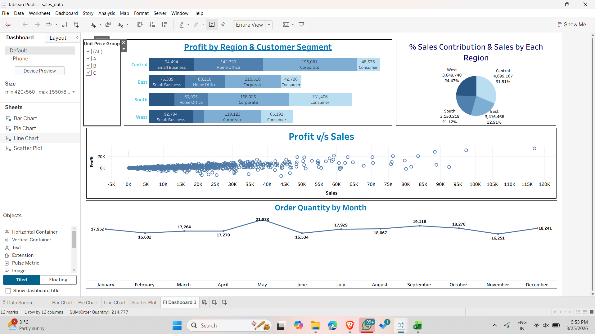
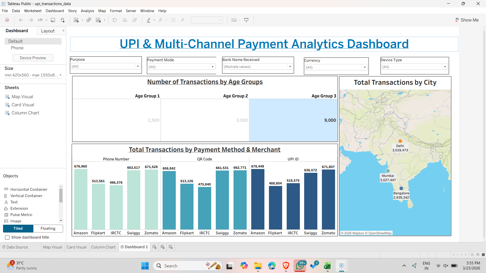

# Tableau Dashboard Projects

This repository contains the Tableau dashboards I created while learning data analytics. These are beginner-level projects, but I have tried to focus on understanding the data and presenting it in a meaningful way.

---

## Dashboard Preview

### Sales & Profit Dashboard

### UPI Payment Analytics Dashboard

---

## Project 1: Sales & Profit Analysis

**What I tried to do:**
I wanted to understand how sales and profit are distributed across different regions and customer segments.

**What this dashboard shows:**

* Profit distribution across regions
* Comparison of customer segments
* Relationship between sales and profit
* Monthly order trends

---

## Project 2: UPI & Payment Analytics

**What I tried to do:**
I explored how digital payments are happening across different cities, age groups, and platforms.

**What this dashboard shows:**

* Transactions by different age groups
* Payment method comparison (UPI, QR, Phone)
* Merchant-wise transactions
* City-level transaction analysis using map

---

## Key Learnings

* How to build dashboards in Tableau
* How to choose the right charts for different types of data
* Basic data analysis and interpretation
* Importance of filters and interactivity

---

## Tools Used

* Tableau
* Excel

---

## Dataset

* sales_data.xls
* upi_transactions_data.xlsx

(Note: This data is used only for practice and learning.)

---

## About Me

I am currently learning data analytics and working on improving my skills in Tableau, SQL, and data visualization by building small projects like this.

